# Graphene HA

Multi-language concurrency escape detector with static and dynamic analysis. Detects when threads, processes, goroutines, or async tasks outlive their intended scope.

## Supported Languages

**Python** • **Java** • **JavaScript/Node.js** • **Go** • **Rust**

## Quick Start

### Install UV (Python Package Runner)

```bash
curl -LsSf https://astral.sh/uv/install.sh | sh
```

### Analyze Code

All functionality is available through the `graphene` command via UV:

```bash
# List available analyzers
uv run graphene list --detailed

# Python analysis (runs both static and dynamic by default)
uv run graphene analyze tests/python/escape_threads.py:spawn_non_daemon_thread \
  --input "test" --repeat 3

# Python analysis - dynamic analysis only
uv run graphene analyze tests/python/escape_threads.py:spawn_non_daemon_thread \
  --analysis-mode dynamic --input "test"

# Java analysis (runs both static and dynamic by default)
uv run graphene analyze com.escape.tests.ThreadEscapes:spawnNonDaemonThread \
  --language java --input "test"

# JavaScript analysis
uv run graphene analyze tests/nodejs/escape_async.js:createLeakingInterval \
  --language javascript --input "test"

# Go analysis
uv run graphene analyze escape_tests:SpawnDetachedGoroutine \
  --language go --input "test"

# Run all Python tests
uv run graphene run-all --language python --generate 10

# Run all tests across all languages
uv run graphene run-all --generate 20
```

### Python-Only Mode (UV)

```bash
uv sync

# Single function
uv run graphene tests.python.escape_threads:spawn_non_daemon_thread --input "test"

# All Python tests
uv run graphene --run-all --python-only --generate 20
```

## What It Detects

### Dynamic Analysis (Runtime)
- **Threads** not joined (Python, Java, Rust)
- **Processes** not joined (Python, Java)
- **Goroutines** that don't complete (Go)
- **Async tasks/timers** that leak (JavaScript, Rust)
- **Thread pools** not shutdown (Java, Python)

### Static Analysis (Source Code)
- Thread/goroutine creation without join
- Timers without cleanup (`setTimeout`, `setInterval`)
- Channels without receives (Go)
- Global concurrency object storage
- Executor services without shutdown

## Analysis Modes

### Default Behavior
By default, **both static and dynamic analyses run together** (`--analysis-mode both`). Results from both analyses are merged and saved to the same session directory.

### Available Modes
- **both** (default): Runs static analysis on source code and dynamic analysis at runtime, combining findings
- **dynamic**: Runtime analysis only - executes code and monitors for escaping concurrency objects
- **static**: Source code analysis only - examines code patterns without execution

All results are saved in a timestamped session directory under `logs/` (or custom `--output-dir`):
```
logs/session_20260220_134137/
├── summary.md          # Overall findings
├── dynamic_results.csv # Execution traces
└── vulnerabilities.md  # Detailed vulnerabilities
```

## Project Structure

```
graphene-ha/
├── src/                       # Rust orchestrator
│   ├── main.rs               # CLI entry point  
│   ├── orchestrator.rs       # Test coordination
│   ├── analyzer/             # Language bridges
│   └── static_analyzer/      # Static analysis
├── analyzers/                # Language-specific analyzers
│   ├── python/               # Python dynamic + static
│   ├── nodejs/               # Node.js dynamic + static
│   ├── go/                   # Go dynamic + static
│   ├── java/                 # Java dynamic (static in Rust)
│   └── rust/                 # Rust dynamic (static in Rust)
├── tests/                    # Test cases for all languages
│   ├── python/               # Python escape examples
│   ├── nodejs/               # JavaScript examples
│   ├── go/                   # Go examples
│   ├── java/                 # Java examples
│   └── rust/                 # Rust examples
└── graphene_ha/              # Python package
    ├── cli.py                # Python CLI
    ├── test_harness.py       # Execution harness
    └── vulnerability_detector.py
```

## CLI Commands

### `graphene analyze`
Analyze a specific function for concurrency escapes.

**Options:**
- `target` - Function to analyze (`module:function` or `file.ext:function`)
- `--input` - Test input (repeatable)
- `--input-file` - File with inputs (one per line)
- `--generate N` - Generate N random inputs (Python only)
- `--repeat N` - Repeat each input N times (default: 3)
- `--timeout N` - Timeout in seconds (default: 5.0)
- `--language` - Force language (python, java, javascript, go, rust)
- `--analysis-mode` - Analysis mode: `dynamic`, `static`, or `both` (default: dynamic)
- `--log-dir` - Output directory (default: logs)
- `--verbose` - Detailed logging

**Python-only options:**
- `--thread-mode` - No process isolation
- `--main-thread-mode` - Run in main thread
- `--process-mode` - Full process isolation
- `--show-ok` - Show passing tests
- `--test-name` - Session name

### `graphene run-all`
Run all test suites across languages.

**Options:**
- `--test-dir` - Test directory (default: tests)
- `--generate N` - Inputs per test (default: 10)
- `--log-dir` - Output directory (default: logs)
- `--language` - Filter by language
- `--python-only` - Use native Python harness for Python tests only
- `--verbose` - Detailed logging

**Python-only mode options:**
- `--repeat N` - Repeat each input
- `--seed N` - Random seed
- `--timeout N` - Timeout in seconds
- `--thread-mode` - No process isolation
- `--main-thread-mode` - Run in main thread
- `--process-mode` - Full process isolation
- `--test-name` - Session name
- `--show-ok` - Show passing tests

### `graphene list`
List available analyzers.

**Options:**
- `--detailed` - Show detailed capabilities

## Examples

### Basic Analysis

```bash
# Detect Python thread leak
uv run graphene analyze tests/python/escape_threads.py:spawn_non_daemon_thread \
  --input "test" --repeat 3

# Java thread escape  
uv run graphene analyze com.escape.tests.ThreadEscapes:spawnMultipleThreads \
  --language java --input "test"
```

### Static + Dynamic Analysis

```bash
# Run both analysis modes
uv run graphene analyze tests/python/escape_threads.py:spawn_multiple_threads \
  --analysis-mode both --input "test"

# Static analysis only
uv run graphene analyze tests/python/escape_threads.py:spawn_multiple_threads \
  --analysis-mode static
```

### Multi-Language Testing

```bash
# JavaScript setInterval leak
uv run graphene analyze tests/nodejs/escape_async.js:createLeakingInterval \
  --language javascript --input "test"

# Go goroutine leak
uv run graphene analyze escape_tests:SpawnDetachedGoroutine \
  --language go --input "test"

# Rust tokio task leak
uv run graphene analyze tests_rust::escape_async::spawn_detached_task \
  --language rust --input "test"
```

### Batch Testing

```bash
# All Python tests
uv run graphene run-all --language python --generate 10

# All tests across all languages
uv run graphene run-all --generate 20

# Python tests with native harness (more control)
uv run graphene run-all --python-only --generate 5 --thread-mode
```

```bash
# Multiple inputs from file
uv run graphene analyze tests/python/escape_pool.py:leak_process_pool \
  --input-file inputs.txt --repeat 2

# Generated inputs with seed
uv run graphene analyze escape_tests:SpawnWaitingGoroutine \
  --language go --generate 50 --seed 42

# All tests across languages
uv run graphene run-all --generate 20 --timeout 10
```

## Building Language Bridges

### Python
No build needed (uses standard library).

### Java
```bash
cd analyzers/java
mvn clean package
```

### Node.js
```bash
cd analyzers/nodejs
npm install  # if dependencies added
```

### Go
```bash
cd analyzers/go
go build -o escape-analyzer main.go
go build -o static-escape-analyzer static_analyzer.go
```

### Rust
```bash
cd analyzers/rust
cargo build --release
```

## Test Examples

Each language has comprehensive test cases in `tests/<language>/`:

- **Escape cases**: Functions that leak concurrency resources
- **No-escape cases**: Functions that properly clean up
- **Edge cases**: Daemon threads, nested spawns, pools, etc.

See individual test directories for detailed examples and README files.

## Architecture

The system uses a **Rust orchestrator** that coordinates **language-specific analyzer bridges**. All functionality is exposed through a unified Python CLI that delegates to the Rust binary when needed:

```mermaid
graph TB
    User["👤 User"]
    CLI["Python CLI<br/>(graphene_ha/cli.py)<br/>Smart Routing Logic"]
    
    User -->|"uv run graphene"| CLI
    
    CLI -->|"Python-only<br/>dynamic?"| NativeHarness["Native Python Harness<br/>⚡ Fast execution"]
    CLI -->|"Multi-language<br/>or static?"| RustOrch["Rust Orchestrator Binary<br/>(graphene-ha)"]
    
    RustOrch -->|"JSON over stdin/stdout"| PythonBridge["🐍 Python Bridge"]
    RustOrch -->|"JSON over stdin/stdout"| JavaBridge["☕ Java Bridge"]
    RustOrch -->|"JSON over stdin/stdout"| JSBridge["📜 JavaScript Bridge"]
    RustOrch -->|"JSON over stdin/stdout"| GoBridge["🔷 Go Bridge"]
    RustOrch -->|"JSON over stdin/stdout"| RustBridge["🦀 Rust Bridge"]
    
    PythonBridge --> Results["📊 Test Results"]
    JavaBridge --> Results
    JSBridge --> Results
    GoBridge --> Results
    RustBridge --> Results
    NativeHarness --> Results
    
    Results --> Logs["logs/ directory<br/>CSV, Markdown, JSON"]
    
    style CLI fill:#e1f5ff
    style NativeHarness fill:#d4edda
    style RustOrch fill:#fff3cd
    style Results fill:#f8d7da
```



**Key Components:**

1. **Python CLI** (`graphene_ha/cli.py`) - Unified interface via `uv run graphene`
2. **Orchestrator** (`src/`) - Rust binary that schedules tests and aggregates results
3. **Bridges** (`analyzers/`) - Language-specific analyzers that detect escapes
4. **Protocol** (`src/protocol.rs`) - JSON-based communication between orchestrator and bridges
5. **Static Analyzers** - AST/source analysis for each language
6. **Dynamic Analyzers** - Runtime execution and monitoring

**Workflow:**
- Python-only dynamic analysis → Native Python execution (fast)
- Static analysis or multi-language → Rust binary delegation
- First run automatically builds Rust binary if needed

Bridges communicate via JSON over stdin/stdout. See `analyzers/README.md` for protocol details.

## Advanced: Direct Binary Access

For advanced use cases (scripting, custom integrations, or environments without UV), the Rust binary can be invoked directly:

```bash
# Build manually
cargo build --release

# Use directly (note: --target flag required for binary)
./target/release/graphene-ha analyze --target <target> --input "test"
./target/release/graphene-ha run-all --generate 10
./target/release/graphene-ha list
```

**Note:** The direct binary syntax differs slightly:
- Uses `--target` instead of positional argument
- No automatic build (must run `cargo build --release` first)
- No Python-native mode optimization

**Recommended:** Use `uv run graphene` for simpler workflow and automatic binary management.

## Output

Results are written to `logs/` directory:
- **CSV files** - Structured data (escape_detected, execution_time, etc.)
- **Markdown reports** - Human-readable summaries
- **JSON logs** - Detailed test results

## Contributing

When adding a new language:
1. Create `analyzers/<language>-bridge/` 
2. Implement dynamic analyzer (runtime detection)
3. Implement or integrate static analyzer (optional)
4. Add test cases in `tests/<language>/`
5. Update `src/analyzer/<language>.rs` bridge interface
6. Document in `analyzers/<language>-bridge/README.md`

See `analyzers/README.md` for protocol specifications.

## License

MIT
