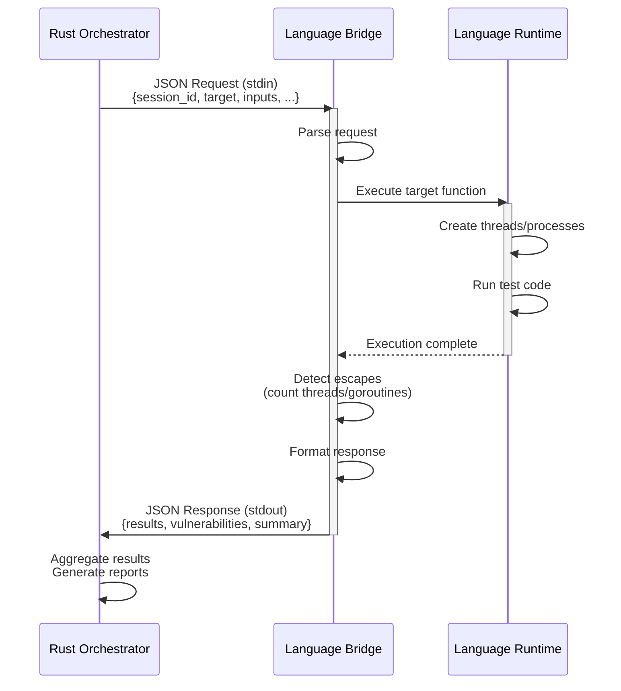

# Language Analyzers

This directory contains bridge implementations for analyzing code in different programming languages.

## Directory Structure

Each language has its own bridge directory following a consistent organization:

```
analyzers/
├── python/     # Python analysis bridge
├── nodejs/     # Node.js/JavaScript analysis bridge
├── go/         # Go analysis bridge
├── java/       # Java analysis bridge
└── rust/       # Rust analysis bridge
```

## File Organization Conventions

Each bridge follows these naming conventions:

### Dynamic Analyzers
- **Python**: `analyzer_bridge.py`
- **Node.js**: `analyzer_bridge.js`
- **Go**: `main.go` (Go convention for main executable)
- **Java**: `src/main/java/com/escape/analyzer/AnalyzerBridge.java` (Maven structure)
- **Rust**: `src/main.rs` (Cargo convention for main executable)

### Static Analyzers
- **Python**: `static_analyzer.py`
- **Node.js**: `static_analyzer.js`
- **Go**: `static_analyzer.go` (also uses embedded analysis in Rust)
- **Java**: Implemented in Rust (`src/static_analyzer/java.rs`)
- **Rust**: Implemented in Rust (`src/static_analyzer/rust.rs`)

### Documentation
- Each bridge has a `README.md` explaining its structure and usage

### Package Manifests
- **Python**: No manifest (uses standard library)
- **Node.js**: `package.json`
- **Go**: `go.mod`
- **Java**: `pom.xml` (Maven)
- **Rust**: `Cargo.toml`

## Communication Protocol

All bridges communicate with the Rust orchestrator using JSON over stdin/stdout:



**Request Format:**
```json
{
  "session_id": "unique-id",
  "target": "module:function",
  "inputs": ["test_input"],
  "repeat": 1,
  "timeout_seconds": 5.0,
  "options": {}
}
```

**Response Format:**
```json
{
  "session_id": "unique-id",
  "language": "python",
  "analyzer_version": "1.0.0",
  "results": [...],
  "vulnerabilities": [...],
  "summary": {...}
}
```

## Analysis Types

### Dynamic Analysis
Executes code and monitors runtime behavior:
- Thread/goroutine/process creation and lifecycle
- Async resource tracking
- Execution time measurement
- Crash detection

### Static Analysis
Analyzes source code without execution:
- AST/syntax tree analysis
- Pattern matching for concurrency primitives
- Data flow tracking
- Escape detection

## Building Bridges

### Python
No build required (interpreted language)

### Node.js
```bash
cd nodejs
npm install  # if dependencies added
```

### Go
```bash
cd go
go build -o escape-analyzer main.go
go build -o static-escape-analyzer static_analyzer.go
```

### Java
```bash
cd java
mvn clean package
```

### Rust
```bash
cd rust
cargo build --release
```

## Integration

The Rust orchestrator (`src/orchestrator.rs`) automatically:
1. Detects the language from the target specification
2. Invokes the appropriate bridge
3. Handles communication via JSON protocol
4. Aggregates results across multiple test runs

## Adding a New Language

To add support for a new language:

1. Create a new directory: `analyzers/<language>/`
2. Implement dynamic analyzer with the standard protocol
3. Implement or integrate static analyzer
4. Add README.md documenting structure and usage
5. Update `src/orchestrator.rs` to recognize the new language
6. Add analyzer module in `src/analyzer/<language>.rs`
7. Add static analyzer in `src/static_analyzer/<language>.rs`
