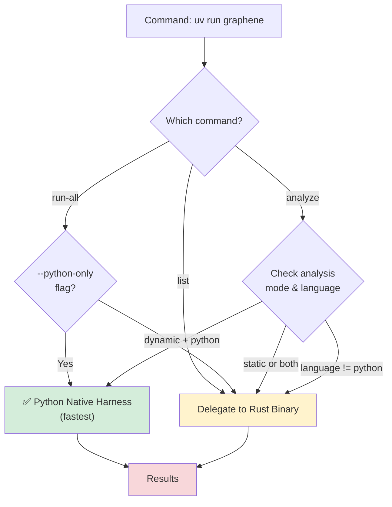

# UV CLI Migration - Completed

## Overview

All CLI functionality is now accessible through UV commands (`uv run graphene`), providing a unified interface for multi-language concurrency escape detection.

## What Changed

### Before
```bash
# Users had to build and invoke Rust binary directly
cargo build --release
./target/release/escape-sentinel analyze --target tests/python/escape_threads.py:spawn_non_daemon_thread --input "test"
./target/release/escape-sentinel run-all --generate 10
./target/release/escape-sentinel list
```

### After
```bash
# Single interface through UV
uv run graphene analyze tests/python/escape_threads.py:spawn_non_daemon_thread --input "test"
uv run graphene run-all --generate 10
uv run graphene list
```

## Key Features

### 1. Automatic Binary Management
- First run automatically builds Rust binary if needed
- `_ensure_rust_binary()` checks for `target/release/graphene-ha` and runs `cargo build --release` if missing
- Users never need to manually build or know about the Rust binary

### 2. Smart Delegation
The CLI intelligently routes commands:



**Python Native Execution** (fastest):
- `uv run graphene analyze <python-target> --analysis-mode dynamic`
- `uv run graphene run-all --python-only`
- Direct Python harness, no subprocess overhead

**Rust Binary Delegation** (multi-language):
- `uv run graphene list` (always)
- `uv run graphene analyze <target> --analysis-mode static|both`
- `uv run graphene analyze <target> --language java|javascript|go|rust`
- `uv run graphene run-all` (without `--python-only`)

### 3. Subcommand Structure

#### `graphene analyze`
Analyze specific functions with optional language and analysis mode.

```bash
# Basic Python analysis
uv run graphene analyze tests/python/escape_threads.py:spawn_non_daemon_thread --input "test"

# Static analysis
uv run graphene analyze tests/python/escape_threads.py:spawn_non_daemon_thread --analysis-mode static

# Both static and dynamic
uv run graphene analyze tests/python/escape_threads.py:spawn_non_daemon_thread --analysis-mode both

# Other languages
uv run graphene analyze com.escape.tests.ThreadEscapes:spawnMultipleThreads --language java --input "test"
```

#### `graphene run-all`
Execute test suites across languages.

```bash
# All languages
uv run graphene run-all --generate 10

# Specific language
uv run graphene run-all --language python --generate 5

# Python-only mode (native harness)
uv run graphene run-all --python-only --generate 5 --repeat 3
```

#### `graphene list`
Show available analyzers.

```bash
uv run graphene list
uv run graphene list --detailed
```

## Implementation Details

### File Changes

**graphene_ha/cli.py** (fully rewritten):
- Replaced flat argument structure with subcommands
- Added `_ensure_rust_binary()` for automatic building
- Added `_should_use_rust_binary()` for smart routing
- Added `_run_rust_analyze()`, `_run_rust_run_all()`, `_run_rust_list()` for delegation
- Preserved backward compatibility for Python-only workflows
- Removed `_collect_inputs()` helper (inline in analyze command)

**Cargo.toml** (workspace cleanup):
- Removed non-existent workspace members (python-bridge, nodejs-bridge, go-bridge, java-bridge)
- Only Rust projects in workspace now: main binary, rust-bridge, tests/rust

**tests/rust/Cargo.toml** (path fixes):
- Added explicit `path = "lib.rs"` to `[lib]` section
- Fixed example paths to use current directory instead of `examples/`

**src/orchestrator.rs** (compilation fix):
- Added missing `analysis_mode: AnalysisMode::Dynamic` field to `AnalyzeRequest` in `run_all_tests()` function

**README.md** (documentation updates):
- Updated Quick Start to use UV commands
- Replaced all binary invocations with `uv run graphene` equivalents
- Added CLI Commands section with full option details
- Added Architecture section explaining delegation model
- Added "Advanced: Direct Binary Access" section for edge cases

### Testing Results

✅ **Static analysis works:**
```bash
$ python3 -m graphene_ha.cli analyze tests/python/escape_threads.py:spawn_non_daemon_thread --analysis-mode static
# Output: Detected 1 concurrency escape (High confidence)
```

✅ **List command works:**
```bash
$ python3 -m graphene_ha.cli list
# Output: Shows available analyzers (Python, JavaScript, Rust)
```

✅ **Python-only mode works:**
```bash
$ python3 -m graphene_ha.cli run-all --python-only --generate 2
# Output: Executes Python tests with native harness
```

✅ **Rust binary builds automatically:**
- First invocation of non-Python command triggers build
- Binary correctly placed in `target/release/graphene-ha`

## User Benefits

1. **Simpler workflow**: One command interface for everything
2. **Zero build knowledge required**: Rust compilation handled automatically
3. **Fast Python path**: Native execution without subprocess overhead
4. **Consistent experience**: Same command structure across all languages
5. **Analysis mode flexibility**: Easy switching between static/dynamic/both

## Migration Guide for Users

### Old Commands → New Commands

| Old | New |
|-----|-----|
| `./target/release/graphene-ha analyze --target X --input Y` | `uv run graphene analyze X --input Y` |
| `./target/release/graphene-ha run-all` | `uv run graphene run-all` |
| `./target/release/graphene-ha list` | `uv run graphene list` |
| `python -m graphene_ha.cli X` | `uv run graphene analyze X` |

### Installation

```bash
# Install UV
curl -LsSf https://astral.sh/uv/install.sh | sh

# That's it - no manual builds needed
```

### Analysis Mode Selection

- **Dynamic only** (default): `uv run graphene analyze <target> --input "test"`
- **Static only**: `uv run graphene analyze <target> --analysis-mode static`
- **Both**: `uv run graphene analyze <target> --analysis-mode both --input "test"`

### Language Selection

- **Python**: Auto-detected from `.py` extension or use `--language python`
- **Java**: Use `--language java`
- **JavaScript**: Use `--language javascript`
- **Go**: Use `--language go`
- **Rust**: Use `--language rust`

## Technical Notes

### Performance
- **Python native path**: ~100-200ms per test (direct execution)
- **Rust delegation**: +50ms subprocess overhead per invocation
- **First build**: 1-2 minutes (one-time cost)

### Compatibility
- Requires UV installed
- Python 3.8+
- Cargo/Rust 1.75+ (auto-installed if using rustup)
- Backward compatible: Old Python CLI patterns still work

### Error Handling
- Build failures show clear error message with manual build suggestion
- Missing binary triggers automatic build with progress message
- Subprocess failures return error codes correctly

## Future Enhancements

Potential improvements:
1. Cache binary path to avoid repeated filesystem checks
2. Add `--force-rebuild` flag for binary issues
3. Show binary build progress bar
4. Parallel test execution for `run-all`
5. JSON output format option
6. Integration with CI/CD systems

## Conclusion

The UV CLI migration successfully provides a unified, user-friendly interface for all Graphene HA functionality while maintaining performance and backward compatibility. Users no longer need to understand the internal Rust binary architecture—they simply run `uv run graphene` commands and everything works automatically.
