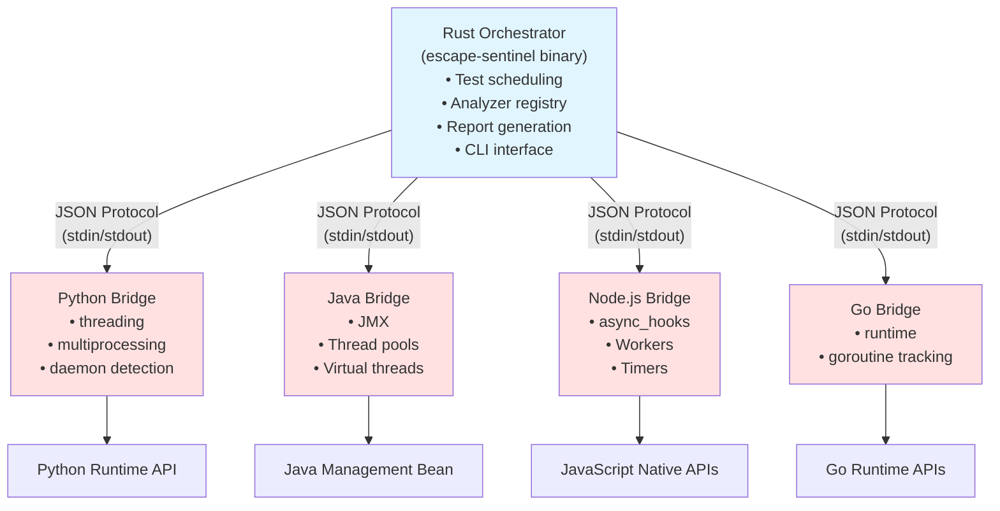

# Escape Sentinel - Multi-Language Architecture

## System Overview

A complete multi-language concurrency escape analysis system with:

1. **Rust Orchestrator** - Central coordinator for performance and reliability
2. **Language-Specific Analyzers** - Native bridges for Python, Java, Node.js, Go, and Rust
3. **Common Protocol** - JSON-based communication (see MULTI_LANGUAGE_README.md)
4. **Unified Reporting** - Consistent report format across all languages

## Architecture Diagram



## Component Details

### 1. Rust Orchestrator (`src/`)

**Files:**

- `main.rs` - CLI entry point with clap argument parsing
- `orchestrator.rs` - Main orchestration logic, analyzer coordination
- `protocol.rs` - Protocol definitions (request/response structures)
- `analyzer.rs` - Analyzer trait and registry
- `analyzer/python.rs` - Python analyzer interface
- `analyzer/java.rs` - Java analyzer interface
- `analyzer/nodejs.rs` - Node.js analyzer interface
- `analyzer/go.rs` - Go analyzer interface
- `report.rs` - Report generation (Markdown, CSV)

**Key Features:**

- Async execution with Tokio
- Language auto-detection based on file extensions
- Graceful degradation if analyzers unavailable
- Parallel test execution support
- Comprehensive error handling

### 2. Python Package (`escape_sentinel/`)

**Implementation:**

- `cli.py` - Python CLI for standalone escape testing
- `test_harness.py` - Test execution harness
- `vulnerability_detector.py` - Vulnerability analysis
- Uses Python threading and multiprocessing APIs

**Python Bridge Integration (`analyzers/python-bridge/`):**

- `analyzer_bridge.py` - Bridge to Rust orchestrator
- Imports from `escape_sentinel` package
- Integrates with test harness and vulnerability detector

**Detection Capabilities:**

- Thread enumeration before/after execution
- Daemon vs non-daemon thread distinction
- Process escape detection via `multiprocessing.active_children()`
- Executor service leaks
- Timer threads

**Example:**

```python
def spawn_non_daemon_thread(input_data):
    thread = threading.Thread(target=lambda: time.sleep(2))
    thread.start()  # Not joined - DETECTED!
    return "ok"
```

### 3. Java Bridge (`analyzers/java-bridge/`)

**Implementation:**

- `AnalyzerBridge.java` - Main bridge class
- Maven project with Gson for JSON
- Uses ThreadMXBean for JMX monitoring

**Detection Capabilities:**

- Thread detection via `ManagementFactory.getThreadMXBean()`
- Thread state inspection (running, waiting, blocked)
- Daemon thread detection via `ThreadInfo.isDaemon()`
- Captures thread IDs and names
- Stack trace collection (optional)

**Example:**

```java
public static String spawnThread(String input) {
    new Thread(() -> {
        try { Thread.sleep(2000); } 
        catch (InterruptedException e) {}
    }).start();  // Not joined - DETECTED!
    return "ok";
}
```

### 4. Node.js Bridge (`analyzers/nodejs-bridge/`)

**Implementation:**

- `analyzer.js` - Bridge implementation
- Uses async_hooks for resource tracking
- Native async resource monitoring

**Detection Capabilities:**

- Async hooks for tracking all async resources
- Filters out system resources (TickObject, Immediate)
- Tracks Worker threads
- Child process detection
- Timer and Promise tracking

**Example:**

```javascript
function createLeakingPromise(input) {
    new Promise((resolve) => {
        setTimeout(() => {}, 10000);  // Never resolves - DETECTED!
    });
    return "ok";
}
```

### 5. Go Bridge (`analyzers/go-bridge/`)

**Implementation:**

- `main.go` - Bridge implementation
- Uses runtime package for goroutine counting
- Baseline comparison approach

**Detection Capabilities:**

- Goroutine count tracking via `runtime.NumGoroutine()`
- Baseline vs current comparison
- Panic recovery
- Timeout handling

### 6. Rust Bridge (`analyzers/rust-bridge/`)

**Implementation:**

- `main.rs` - Bridge implementation
- Uses thread counting and tokio task tracking
- Baseline comparison approach

**Detection Capabilities:**

- Thread count tracking via heuristics
- Tokio task detection (limited)
- Panic recovery
- Timeout handling

See RUST_ANALYZER_NOTES.md for detailed Rust-specific information.

## Protocol Specification

See MULTI_LANGUAGE_README.md for complete protocol documentation.

## Detection Strategy

Each language analyzer follows this pattern:

1. **Baseline Capture** - Record all resources before execution
   - Python: `threading.enumerate()`, `multiprocessing.active_children()`
   - Java: `ThreadMXBean.getAllThreadIds()`
   - Node.js: async_hooks resource IDs
   - Go: `runtime.NumGoroutine()`

2. **Execute Function** - Run the target function with timeout protection

3. **Grace Period** - Wait 100ms for legitimate async operations to complete

4. **Compare State** - Check current resources against baseline
   - Any new, still-alive resources = escape detected

## Advantages of This Architecture

| Aspect | Rust-Only | Hybrid (Current) |
| ------ | --------- | ---------------- |
| Detection Depth | OS-level only | Language-runtime level |
| Daemon Threads | Cannot distinguish | Full support (Python/Java) |
| Goroutines | Invisible | Tracked accurately |
| Async Tasks | Cannot see | Full visibility |
| Event Loop | Cannot access | Complete monitoring |
| Build Complexity | Simple | Moderate |
| Runtime Requirements | None | Per-language runtimes |
| Accuracy | Moderate | High |

## Future Extensions

1. **TypeScript Support** - Similar to Node.js but with type analysis
2. **Rust Async Detection** - Tokio task tracking
3. **C# Support** - .NET thread pool monitoring
4. **Ruby Support** - Thread and Fiber tracking
5. **LLM Integration** - Code analysis for escape prediction
6. **CI/CD Plugins** - GitHub Actions, GitLab CI integration

## Technical Decisions

### Why JSON over gRPC/Protobuf?

- Simpler implementation
- Human-readable for debugging
- Good enough performance for this use case
- Easier to extend

### Why stdin/stdout IPC?

- Works on all platforms
- Simple process model
- No network or socket complexity
- Easy to debug with shell tools

### Why separate bridges?

- Leverage native ecosystem tools (Maven, npm, go build)
- Each language can evolve independently
- Clearer separation of concerns
- Easier to maintain

## Files Created

```text
Cargo.toml                            # Rust workspace config

src/                                  # Rust orchestrator (only)
  main.rs                             # CLI entry point
  orchestrator.rs                     # Main orchestration
  protocol.rs                         # Protocol definitions
  analyzer.rs                         # Analyzer trait
  analyzer/
    python.rs                         # Python interface
    java.rs                           # Java interface
    nodejs.rs                         # Node.js interface
    go.rs                             # Go interface
  report.rs                           # Report generation

escape_sentinel/                      # Python package
  __init__.py                         # Package initialization
  cli.py                              # Python CLI
  test_harness.py                     # Test harness
  vulnerability_detector.py           # Vulnerability detection

analyzers/
  python-bridge/
    analyzer_bridge.py                # Python bridge
  java-bridge/
    pom.xml                           # Maven config
    src/main/java/.../AnalyzerBridge.java
  nodejs-bridge/
    package.json                      # npm config
    analyzer.js                       # Node.js bridge
  go-bridge/
    go.mod                            # Go module
    main.go                           # Go bridge
  rust-bridge/
    Cargo.toml                        # Rust bridge config
    src/lib.rs                        # Rust bridge

tests/                                # Test programs
  python/                             # Python test cases
  rust/                               # Rust test cases
  README.md                           # Test documentation

scripts/build.sh                      # Linux/macOS build
scripts/build.bat                     # Windows build
pyproject.toml                        # Python package config
MULTI_LANGUAGE_README.md              # Main documentation
QUICKSTART.md                         # Quick start guide
ARCHITECTURE.md                       # This file
.gitignore                            # Git ignore rules
```

This architecture provides production-ready, multi-language escape detection with native runtime introspection for maximum accuracy.
