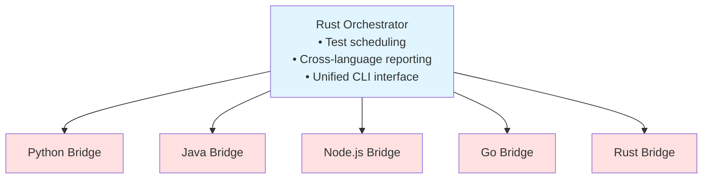

# Escape Sentinel - Multi-Language Concurrency Escape Detector

A comprehensive escape analysis system with Rust orchestrator and language-specific analyzers for Python, Java, Node.js, and Go.

## Architecture



## Building

### Rust Orchestrator

```bash
cargo build --release
```

### Language Bridges

**Python:**

```bash
# No build needed - interpreter-based
chmod +x analyzers/python-bridge/analyzer_bridge.py
```

**Java:**

```bash
cd analyzers/java-bridge
mvn clean package
```

**Node.js:**

```bash
cd analyzers/nodejs-bridge
npm install
chmod +x analyzer.js
```

**Go:**

```bash
cd analyzers/go-bridge
go build -o escape-analyzer main.go
```

**Rust:**

```bash
cd analyzers/rust-bridge
cargo build --release

# Also build test examples
cd ../../tests/rust
cargo build --release --examples
```

## Usage

### Analyze a Python function

```bash
./target/release/escape-sentinel analyze \
  --target tests/python/escape_threads.py:spawn_non_daemon_thread \
  --input "hello" \
  --input "world" \
  --repeat 3
```

### Analyze a Java method

```bash
./target/release/escape-sentinel analyze \
  --target com.example.ThreadTest:testMethod \
  --input "data" \
  --language java
```

### Analyze a Node.js function

```bash
./target/release/escape-sentinel analyze \
  --target ./tests/async_tests.js:createLeakingPromise \
  --input "test" \
  --language javascript
```

### Analyze a Rust function

```bash
./target/release/escape-sentinel analyze \
  --target tests_rust::escape_threads::spawn_detached_thread \
  --input "test" \
  --language rust
```

### List available analyzers

```bash
./target/release/escape-sentinel list --detailed
```

### Run all tests

```bash
./target/release/escape-sentinel run-all \
  --test-dir tests \
  --generate 50
```

## Protocol

All analyzers communicate via JSON over stdin/stdout using a common protocol:

### Request Format

```json
{
  "session_id": "uuid-here",
  "target": "module:function",
  "inputs": ["input1", "input2"],
  "repeat": 3,
  "timeout_seconds": 5.0,
  "options": {}
}
```

### Response Format

```json
{
  "session_id": "uuid-here",
  "language": "python",
  "analyzer_version": "1.0.0",
  "results": [
    {
      "input_data": "test",
      "success": true,
      "crashed": false,
      "escape_detected": true,
      "escape_details": {
        "threads": [
          {
            "thread_id": "123",
            "name": "Worker-1",
            "is_daemon": false,
            "state": "running"
          }
        ],
        "processes": [],
        "async_tasks": [],
        "goroutines": []
      }
    }
  ],
  "vulnerabilities": [
    {
      "input": "test",
      "vulnerability_type": "concurrent_escape",
      "severity": "high",
      "description": "Non-daemon thread escaped"
    }
  ],
  "summary": {
    "total_tests": 3,
    "escapes": 2,
    "crash_rate": 0.0
  }
}
```

## Detection Capabilities

### Python

- Thread detection (daemon vs non-daemon)
- Process escape detection
- Multiprocessing pools
- Executor services
- Timer threads

### Java

- Thread detection via JMX
- Thread pools and ExecutorServices
- Virtual threads (Java 21+)
- Daemon thread distinction

### Node.js

- Async hooks monitoring
- Worker threads
- Child processes
- Timer detection
- Event loop tracking

### Go

- Goroutine leak detection
- Runtime monitoring
- Channel tracking

### Rust

- Thread leak detection (std::thread)
- Tokio task tracking (async/await)
- Panic recovery
- RAII pattern validation
- Scoped thread safety verification

## Reports

Reports are generated in the `logs/` directory with:

- **README.md** - Summary report
- **results.csv** - Detailed test results
- **vulnerabilities.md** - Vulnerability details

## Development

### Adding a New Language

1. Create analyzer bridge in `analyzers/<language>-bridge/`
2. Implement protocol communication (stdin/stdout JSON)
3. Add analyzer struct in `src/analyzer/<language>.rs`
4. Register in `AnalyzerRegistry::initialize_all()`

### Protocol Extensions

To add new escape types, extend `EscapeDetails` in `src/protocol.rs` and update all language bridges.

## License

MIT
